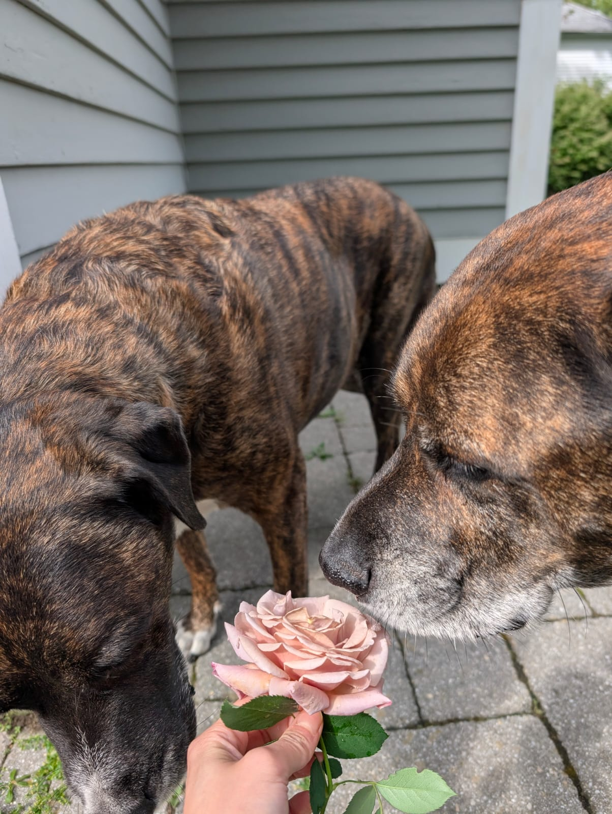

# Rosle
<table border="0">
 <tr>
    <td style="width:60%">
        A daily rose guessing game built as a birthday present for my girlfriend, who loves rose plants
    </td>
    <td>
        
        My pups Thunder and Storm, may they rest in peace, smelling a Hot Cocoa rose from our garden
    </td>
 </tr>
</table>

This project consists of two main components, a scraper to build out the database, and a web-application that can be deployed as a static website.

You can play rosle at rosle.pages.dev

## Development
Just run `npm run dev`

## Build
`npm run build`

## TODOs

### Major (Blocking public release)
- [ ] Build initial DB
- [ ] DB should have 1 year's worth of roses
- [ ] Fix layout issues across desktop and mobile

### Minor
- [ ] Refactor App.tsx to split out 
- [ ] Move question & submit UX into fixed footer
- [ ] Reconsider where answers are rendered, as they can appear below the fold for the Bloom Shape question
- [ ] Figure out why rose image isnt centering

## App design
1. Given day - look up rose and render image + name
2. Build questions (5):
    Bloom Size (Inches - 0-5) - whole number match only
    Bloom shape (enum tbd) - exact match only
    Petal Count (0-80) - within 10% acceptable to score
    Class (enum tbd) - exact match only
    Optimal Growing Zones (1-10) - exact match/within range
3. Submit & score (one at a time?)
4. Share to clipboard w/emoji

